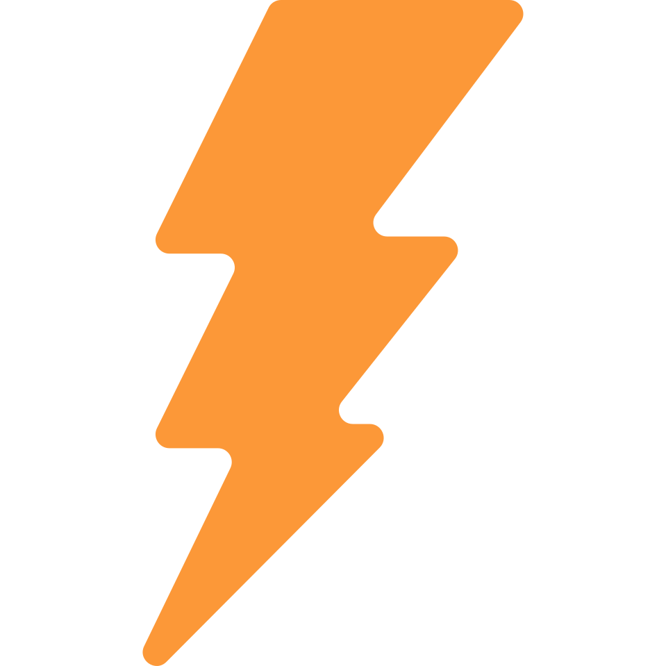
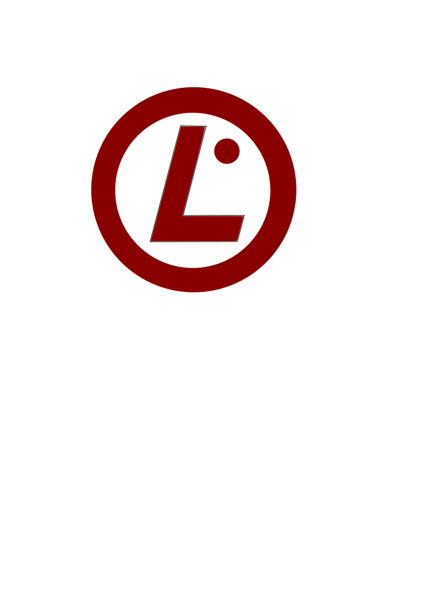

* <a href="../programm/">Programm</a>
* Rahmenprogramm
* <a href="../lageplan/">Lageplan</a>
* <a href="../programm_was_bedeuten_die_icons">Was bedeuten die Icons      ?</a>
* <a href="https://f-droid.org/repository/browse/?fdid=net.gaast.giggity" target="_blank">&nbsp;Giggity</a> (bei
<a href="https://f-droid.org/" target="_blank">&nbsp;F-Droid</a>)
* <a href="https://play.google.com/store/apps/details?id=net.gaast.giggity" target="_blank">&nbsp;Giggity</a> (bei
&nbsp;Google Play)
* <a href="https://apps.apple.com/us/app/tuebix/id1469354958" target="_blank">quick hack für das unfreie iOS</a> (feature requests: <a href="https://github.com/zenitaeglos/TuebixApp" target="_blank">github issue)</a> 

 

### Freitag Abend: Auftakt

Am Vorabend: 5. Juli ab 18:00 Uhr

Wir werden den Auftakt in der <a href="http://www.tuepedia.de/wiki/Stadtpost" target="_blank">Stadtpost</a>
in der <a href="http://osm.org/go/0DkqBIl9K?m=&node=289739544" target="_blank">Neuen Straße 9</a> machen.

Treffpunkt: Um 18:00 Uhr 

Bitte im Pad eintragen, wenn du vorhast zu kommen:
<a href="https://pad.tuebix.org/p/2019-auftakt" target="_blank">Auftakt-Pad</a>

### Samstag Abend: Ausklang

Direkt im Anschluss an die Vorträge und Workshops ab 19:15 Uhr auf dem Sand.

Hinter den Gebäuden auf dem Sand gibt es eine schöne Terasse mit Garten, wo wir
gemeinsam den Tübinger Linuxtag ausklingen lassen wollen.
Die Fachschaft wird den Grill anwerfen.

### Food Truck zum Mittag, Grill gegen Abend

Während der Mittagszeit (etwa 11:00 bis 15:00 Uhr) wird
<a href="https://derproviantmeister.de/" target="_blank">Der Proviantmeister</a>
(Food Truck) auf dem Sand sein.
Danach gibt es Grillwurst und Grillkäse (etwa 15:00 bis 20:00 Uhr).

### Getränke

Die Fachschaft Informatik (fsi)
<a href="../../callforhelpers">(und zeitweise Du?)</a>
werden den ganzen Tag über Getränke verkaufen.
